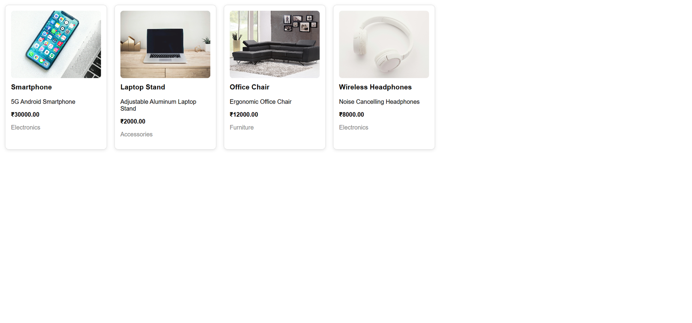

# 🛒 E-Commerce Frontend (React + Vite)

🌐 Live Demo: https://ecommerce-frontend-theta-coral.vercel.app

---

## 🚀 Project Overview

This is the frontend application of a full-stack E-Commerce platform.

It is built using **React (Vite)** and connects to a production backend deployed on **Render**, which communicates with a **MySQL database**.

The application demonstrates full-stack integration including server-side pagination, sorting, filtering, and clean component architecture.

---

## 🌍 Live Architecture

Frontend (Vercel)  
⬇  
Backend API (Render)  
⬇  
MySQL Database  

---

## ✨ Features

- Dynamic product listing from live API
- Server-side pagination
- Sorting (Price Low → High / High → Low)
- Category-based filtering
- Clean grid-based layout
- Component-based architecture
- Production deployment (Vercel + Render)

---

## 🧱 Component Architecture

```
src/
 ├── api/
 │    └── axios.js
 ├── components/
 │    ├── ProductCard.jsx
 │    ├── Filters.jsx
 │    └── Pagination.jsx
 └── App.jsx
```

The application follows separation of concerns:

- `App.jsx` → State management & orchestration  
- `ProductCard` → Presentation layer  
- `Filters` → Sorting & category control  
- `Pagination` → Page navigation logic  

---

## 📸 Screenshots

### 🏠 Product Grid


### 📄 Pagination in Action


### 🔽 Sorting Feature


### 🗂 Category Filtering


---

## 🔧 Tech Stack

- React
- Vite
- Axios
- REST API
- Render (Backend Deployment)
- Vercel (Frontend Deployment)
- MySQL (Database)

---

## 📦 Local Installation

Clone the repository:

```bash
git clone <repo-url>
```

Navigate to project folder:

```bash
cd ecommerce-frontend
```

Install dependencies:

```bash
npm install
```

Run development server:

```bash
npm run dev
```

---

## 👤 Author

Lovepreet Singh  
Full-Stack Developer  
